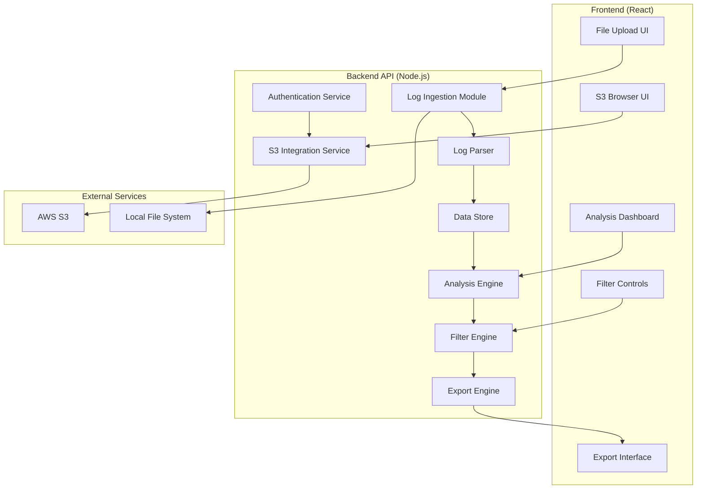

# Design Document

## Overview

The ALB Flow Analyzer is a web-based application that processes AWS Application Load Balancer flow logs to extract usage patterns and generate test configurations for AWS Distributed Load Testing. The system consists of a React frontend and a Node.js backend API, following a pipeline architecture with distinct phases: ingestion, parsing, analysis, and export.

The system is designed to handle large log files efficiently from both local uploads and S3 buckets, providing flexible filtering and analysis capabilities through an intuitive web interface. It outputs both human-readable reports and machine-readable configurations for AWS Distributed Load Testing.

## Architecture

The system follows a client-server architecture with a modular backend pipeline:



### Core Components

**Frontend Components**:
1. **File Upload UI**: Drag-and-drop interface for local log files
2. **S3 Browser UI**: Interface for browsing and selecting S3 objects
3. **Analysis Dashboard**: Real-time visualization of analysis results
4. **Filter Controls**: Interactive filtering interface
5. **Export Interface**: Download and configuration generation UI

**Backend Components**:
1. **Authentication Service**: Manages AWS credentials securely
2. **S3 Integration Service**: Handles S3 bucket browsing and file retrieval
3. **Log Ingestion Module**: Handles file reading and preprocessing
4. **Log Parser**: Parses ALB flow log format into structured data
5. **Data Store**: In-memory storage with indexing for efficient querying
6. **Analysis Engine**: Computes metrics, patterns, and statistics
7. **Filter Engine**: Applies user-defined filters to data
8. **Export Engine**: Generates various output formats

## Components and Interfaces

### Authentication Service

**Purpose**: Securely manage AWS credentials and sessions

**Interface**:
```typescript
interface AuthenticationService {
  validateCredentials(credentials: AWSCredentials): Promise<boolean>
  storeCredentials(credentials: AWSCredentials): Promise<string> // returns session token
  getCredentials(sessionToken: string): Promise<AWSCredentials>
  revokeSession(sessionToken: string): Promise<void>
}
```

**Responsibilities**:
- Validate AWS credentials
- Securely store credentials in memory (not persisted)
- Manage session tokens
- Handle credential rotation

### S3 Integration Service

**Purpose**: Browse S3 buckets and retrieve log files

**Interface**:
```typescript
interface S3IntegrationService {
  listBuckets(credentials: AWSCredentials): Promise<S3Bucket[]>
  listObjects(bucketName: string, prefix: string, credentials: AWSCredentials): Promise<S3Object[]>
  searchLogFiles(bucketName: string, searchCriteria: S3SearchCriteria, credentials: AWSCredentials): Promise<S3Object[]>
  downloadObject(bucketName: string, key: string, credentials: AWSCredentials): Promise<Buffer>
  getObjectMetadata(bucketName: string, key: string, credentials: AWSCredentials): Promise<S3ObjectMetadata>
}
```

**Responsibilities**:
- Browse S3 buckets and objects
- Recursive search through bucket contents
- Filter objects by file extension, date, size
- Stream large files efficiently
- Handle S3 pagination

### Log Ingestion Module

**Purpose**: Read and preprocess ALB flow log files from multiple sources

**Interface**:
```typescript
interface LogIngestion {
  loadLocalFiles(filePaths: string[]): Promise<LogEntry[]>
  loadS3Files(s3Objects: S3Object[], credentials: AWSCredentials): Promise<LogEntry[]>
  validateLogFormat(entry: string): boolean
  handleMalformedEntries(entry: string, error: Error): void
  getProcessingProgress(): ProcessingProgress
}
```

**Responsibilities**:
- Read log files from local filesystem uploads
- Stream log files from S3
- Validate log entry format
- Handle compressed files (gzip)
- Provide real-time progress feedback for large files
- Support concurrent processing of multiple files

### Log Parser

**Purpose**: Parse ALB flow log entries into structured data

**Interface**:
```typescript
interface LogParser {
  parseEntry(logLine: string): ParsedLogEntry
  extractFields(logLine: string): LogFields
  validateParsedEntry(entry: ParsedLogEntry): boolean
}
```

**ALB Flow Log Fields** (based on AWS documentation):
- type, version, account-id, interface-id, srcaddr, dstaddr, srcport, dstport
- protocol, packets, bytes, windowstart, windowend, action
- flowlogstatus, vpc-id, subnet-id, instance-id, tcp-flags, type, pkt-srcaddr, pkt-dstaddr

### Data Store

**Purpose**: Efficient data storage with indexing and querying capabilities

**Interface**:
```typescript
interface DataStore {
  store(entries: ParsedLogEntry[]): Promise<void>
  query(filters: FilterCriteria): Promise<ParsedLogEntry[]>
  createIndex(field: string): Promise<void>
  getStats(): Promise<StorageStats>
  clearData(): Promise<void>
  getDataSize(): Promise<number>
}
```

**Storage Options**:

1. **SQLite (Recommended for MVP)**:
   - File-based database, no separate server required
   - Excellent performance for read-heavy workloads
   - Built-in indexing and query optimization
   - Handles datasets up to several TB
   - Easy deployment and backup

2. **PostgreSQL (For Production Scale)**:
   - Full-featured relational database
   - Advanced indexing (B-tree, GIN, GiST)
   - Excellent analytics capabilities with window functions
   - Horizontal scaling options
   - JSON support for flexible schema

3. **ClickHouse (For Analytics Workloads)**:
   - Columnar database optimized for analytics
   - Extremely fast aggregation queries
   - Excellent compression ratios
   - Built-in time-series functions
   - Handles petabyte-scale datasets

4. **DuckDB (For Analytical Processing)**:
   - In-process analytical database
   - Optimized for OLAP workloads
   - Excellent performance on aggregations
   - Parquet file support
   - No server management required

**Recommended Architecture**:
- **Development/Small datasets**: SQLite
- **Production/Medium datasets**: PostgreSQL
- **Large-scale analytics**: ClickHouse or DuckDB

**Database Schema Design**:
```sql
-- Main log entries table
CREATE TABLE log_entries (
  id BIGSERIAL PRIMARY KEY,
  timestamp TIMESTAMP WITH TIME ZONE NOT NULL,
  client_ip INET,
  target_ip INET,
  request_processing_time DECIMAL(10,6),
  target_processing_time DECIMAL(10,6),
  response_processing_time DECIMAL(10,6),
  elb_status_code INTEGER,
  target_status_code INTEGER,
  received_bytes BIGINT,
  sent_bytes BIGINT,
  request_verb VARCHAR(10),
  request_url TEXT,
  request_protocol VARCHAR(20),
  user_agent TEXT,
  ssl_cipher VARCHAR(100),
  ssl_protocol VARCHAR(20),
  target_group_arn TEXT,
  trace_id VARCHAR(100),
  domain_name VARCHAR(255),
  chosen_cert_arn TEXT,
  matched_rule_priority INTEGER,
  request_creation_time TIMESTAMP WITH TIME ZONE,
  actions_executed TEXT,
  redirect_url TEXT,
  error_reason TEXT,
  target_port_list TEXT,
  target_status_code_list TEXT,
  classification VARCHAR(50),
  classification_reason TEXT,
  created_at TIMESTAMP WITH TIME ZONE DEFAULT NOW()
);

-- Indexes for common query patterns
CREATE INDEX idx_log_entries_timestamp ON log_entries(timestamp);
CREATE INDEX idx_log_entries_request_url ON log_entries(request_url);
CREATE INDEX idx_log_entries_status_code ON log_entries(elb_status_code);
CREATE INDEX idx_log_entries_client_ip ON log_entries(client_ip);
CREATE INDEX idx_log_entries_domain ON log_entries(domain_name);
```

**Indexing Strategy**:
- Time-based indexing for temporal queries
- URL pattern indexing for endpoint analysis
- Status code indexing for error analysis
- Client IP indexing for traffic source analysis
- Composite indexes for common filter combinations

### Analysis Engine

**Purpose**: Compute metrics and identify patterns

**Interface**:
```typescript
interface AnalysisEngine {
  calculateTrafficMetrics(entries: ParsedLogEntry[]): TrafficMetrics
  identifyPeakPeriods(entries: ParsedLogEntry[]): PeakPeriod[]
  analyzeEndpointUsage(entries: ParsedLogEntry[]): EndpointStats[]
  computeResponseTimePercentiles(entries: ParsedLogEntry[]): ResponseTimeStats
  generateLoadPattern(entries: ParsedLogEntry[]): LoadPattern
}
```

**Key Metrics**:
- Requests per minute/hour/day
- Response time percentiles (50th, 90th, 95th, 99th)
- Status code distribution
- Endpoint frequency analysis
- Peak traffic identification
- User agent categorization

### Filter Engine

**Purpose**: Apply filtering criteria to data

**Interface**:
```typescript
interface FilterEngine {
  applyTimeFilter(entries: ParsedLogEntry[], start: Date, end: Date): ParsedLogEntry[]
  applyEndpointFilter(entries: ParsedLogEntry[], patterns: string[]): ParsedLogEntry[]
  applyStatusCodeFilter(entries: ParsedLogEntry[], codes: number[]): ParsedLogEntry[]
  applyClientFilter(entries: ParsedLogEntry[], clientCriteria: ClientFilter): ParsedLogEntry[]
  combineFilters(entries: ParsedLogEntry[], filters: FilterCriteria[]): ParsedLogEntry[]
}
```

### Export Engine

**Purpose**: Generate various output formats and handle downloads

**Interface**:
```typescript
interface ExportEngine {
  exportCSV(data: AnalysisResult[]): Promise<Buffer>
  exportJSON(data: AnalysisResult[]): Promise<Buffer>
  generateReport(data: AnalysisResult): Promise<Buffer>
  generateAWSLoadTestConfig(analysis: AnalysisResult): Promise<AWSLoadTestConfig>
  exportCharts(metrics: TrafficMetrics): Promise<ChartData[]>
  createDownloadLink(data: Buffer, filename: string): Promise<string>
}
```

## Frontend Components

### File Upload Component
```typescript
interface FileUploadProps {
  onFilesSelected: (files: File[]) => void
  acceptedTypes: string[]
  maxFileSize: number
  multiple: boolean
}
```

### S3 Browser Component
```typescript
interface S3BrowserProps {
  credentials: AWSCredentials
  onFilesSelected: (objects: S3Object[]) => void
  searchCriteria: S3SearchCriteria
  onSearchCriteriaChange: (criteria: S3SearchCriteria) => void
}
```

### Analysis Dashboard Component
```typescript
interface AnalysisDashboardProps {
  analysisResults: AnalysisResult
  isLoading: boolean
  onFilterChange: (filters: FilterCriteria) => void
}
```

### Credential Management Component
```typescript
interface CredentialManagerProps {
  onCredentialsSubmit: (credentials: AWSCredentials) => void
  onCredentialsValidated: (isValid: boolean) => void
  isValidating: boolean
}
```

## Data Models

### AWSCredentials
```typescript
interface AWSCredentials {
  accessKeyId: string
  secretAccessKey: string
  sessionToken?: string
  region: string
}
```

### S3Object
```typescript
interface S3Object {
  key: string
  size: number
  lastModified: Date
  etag: string
  storageClass: string
}
```

### S3SearchCriteria
```typescript
interface S3SearchCriteria {
  prefix?: string
  fileExtensions?: string[]
  dateRange?: {
    start: Date
    end: Date
  }
  maxSize?: number
  recursive: boolean
}
```

### ProcessingProgress
```typescript
interface ProcessingProgress {
  totalFiles: number
  processedFiles: number
  currentFile: string
  totalBytes: number
  processedBytes: number
  estimatedTimeRemaining: number
  errors: ProcessingError[]
}
```

### DatabaseConfig
```typescript
interface DatabaseConfig {
  type: 'sqlite' | 'postgresql' | 'clickhouse' | 'duckdb'
  connectionString?: string
  host?: string
  port?: number
  database: string
  username?: string
  password?: string
  maxConnections?: number
  ssl?: boolean
}
```

### StorageStats
```typescript
interface StorageStats {
  totalEntries: number
  databaseSize: number
  oldestEntry: Date
  newestEntry: Date
  indexCount: number
  compressionRatio?: number
}
```

### ParsedLogEntry
```typescript
interface ParsedLogEntry {
  timestamp: Date
  clientIp: string
  targetIp: string
  requestProcessingTime: number
  targetProcessingTime: number
  responseProcessingTime: number
  elbStatusCode: number
  targetStatusCode: number
  receivedBytes: number
  sentBytes: number
  requestVerb: string
  requestUrl: string
  requestProtocol: string
  userAgent: string
  sslCipher?: string
  sslProtocol?: string
  targetGroupArn: string
  traceId: string
  domainName: string
  chosenCertArn?: string
  matchedRulePriority: number
  requestCreationTime: Date
  actionsExecuted: string
  redirectUrl?: string
  errorReason?: string
  targetPortList: string
  targetStatusCodeList: string
  classification: string
  classificationReason: string
}
```

### AWSLoadTestConfig
```typescript
interface AWSLoadTestConfig {
  testName: string
  testDescription: string
  taskCount: number
  concurrency: number
  rampUpTime: number
  holdForTime: number
  rampDownTime: number
  scenarios: TestScenario[]
  regions: string[]
}

interface TestScenario {
  name: string
  weight: number
  requests: TestRequest[]
  thinkTime: number
}

interface TestRequest {
  method: string
  url: string
  headers: Record<string, string>
  body?: string
  weight: number
}
```

### TrafficMetrics
```typescript
interface TrafficMetrics {
  totalRequests: number
  requestsPerMinute: TimeSeries[]
  requestsPerHour: TimeSeries[]
  peakPeriods: PeakPeriod[]
  responseTimePercentiles: ResponseTimeStats
  statusCodeDistribution: StatusCodeStats[]
  endpointStats: EndpointStats[]
  userAgentStats: UserAgentStats[]
}
```

## Error Handling

### Parsing Errors
- Log malformed entries with line numbers
- Continue processing remaining entries
- Provide summary of parsing success/failure rates
- Offer suggestions for common format issues

### File Handling Errors
- Handle missing files gracefully
- Provide clear error messages for permission issues
- Support retry mechanisms for network-based file access
- Validate file formats before processing

### Database Management
- Implement connection pooling for concurrent access
- Use batch inserts for efficient data loading
- Implement database cleanup for old analysis sessions
- Support database migrations for schema updates
- Provide database size monitoring and cleanup tools

### Memory Management
- Implement streaming for large files
- Use database cursors for large result sets
- Support chunked processing for very large datasets
- Implement connection pooling to manage database connections

### Export Errors
- Validate output directory permissions
- Handle disk space issues
- Provide rollback for partial exports
- Validate generated configurations

## Testing Strategy

### Unit Testing
- Test each component in isolation
- Mock external dependencies (file system, network)
- Test edge cases and error conditions
- Validate data transformations

### Integration Testing
- Test complete pipeline with sample data
- Validate AWS Load Test config generation
- Test filtering combinations
- Verify export format compatibility

### Performance Testing
- Test with large log files (>1GB)
- Measure memory usage patterns
- Validate processing time scalability
- Test concurrent processing capabilities

### End-to-End Testing
- Process real ALB flow logs
- Generate and validate AWS Load Test configs
- Test generated configs with AWS Distributed Load Testing
- Verify report accuracy against known data

### Frontend Testing
- Component unit tests with React Testing Library
- User interaction testing with mock data
- S3 browser component testing with mocked AWS SDK
- Credential validation flow testing
- File upload component testing with various file types

### API Testing
- REST API endpoint testing
- AWS credential validation testing
- S3 integration testing with test buckets
- File upload and processing endpoint testing
- WebSocket testing for real-time progress updates

### Security Testing
- Credential handling security validation
- Input sanitization testing
- CORS configuration testing
- Session management testing

### Test Data Strategy
- Create synthetic ALB flow logs for testing
- Include edge cases (malformed entries, unusual patterns)
- Test with various time ranges and traffic patterns
- Validate against real production log samples
- Mock S3 responses for frontend testing